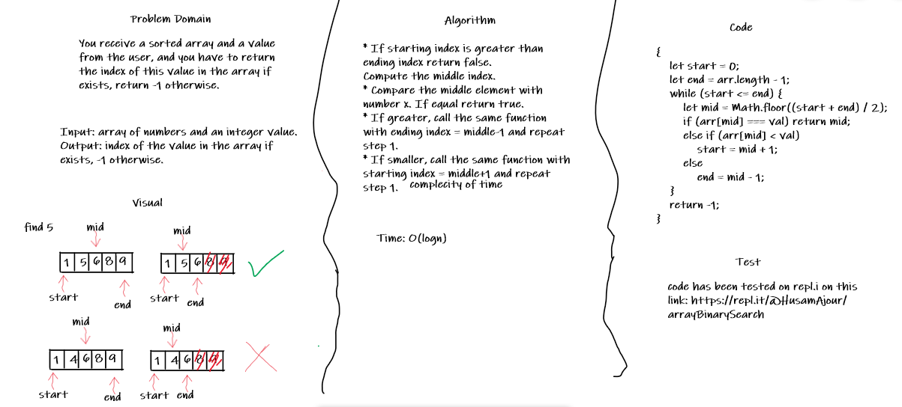

# Array Binary Search

## Challenge

You receive a sorted array and a value from the user, and you have to return the index of this value in the array if exists, return -1 otherwise.

## Approach & Efficiency

* If starting index is greater than ending index return false.
Compute the middle index.
* Compare the middle element with number x. If equal return true.
* If greater, call the same function with ending index = middle-1 and repeat step 1.
* If smaller, call the same function with starting index = middle+1 and repeat step 1.

The complexity of this apprach is O(log n) which is good.

## Solution

