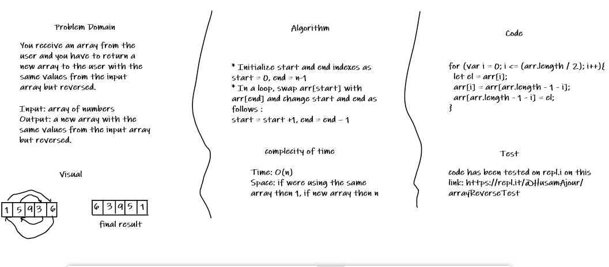

# Reverse an Array

## Challenge

You receive an array from the user and you have to return a new array to the user with the same values from the input array but reversed.

## Approach & Efficiency

* Initialize start and end indexes as start = 0, end = n-1 
* In a loop, swap arr[start] with arr[end] and change start and end as follows : 
start = start +1, end = end – 1

The complexity of this apprach is O(n) which is good.

## Solution

