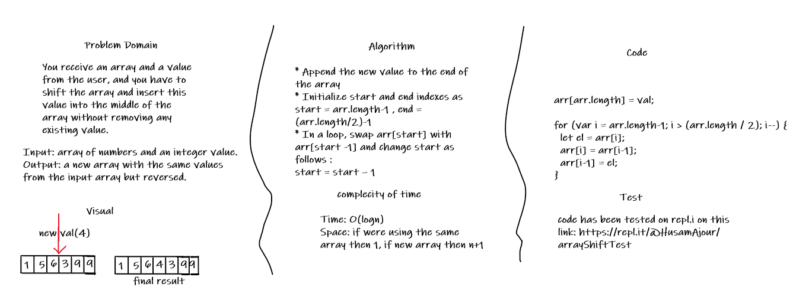

# Shift an Array

## Challenge

You receive an array and a value from the user, and you have to shift the array and insert this value into the middle of the array without removing any existing value.

## Approach & Efficiency

* Append the new value to the end of the array
* Initialize start and end indexes as start = arr.length-1 , end = (arr.length/2)-1
* In a loop, swap arr[start] with arr[start -1] and change start as follows : 
start = start – 1
The complexity of this apprach is O(log n) which is good.

## Solution

