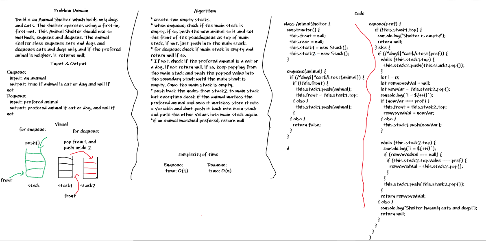

# Animal Shelter

## Challenge

Build a an Animal Shelter which holds only dogs and cats. The shelter operates using a first-in, first-out. This Animal Shelter should use to methods, enqueue and dequeue.

## Approach & Efficiency

* create two empty stacks.
* when enqueue; check if the main stack is empty, if so, push the new animal to it and set the front of the psuedoqueue as top of main stack, if not, just push into the main stack.
* for dequeue; check if main stack is empty and return null if so.
* If not, check if the prefered anumal is a cat or a dog, if not return null. if so, keep popping from the main stack and push the popped value into the secondary stack until the main stack is empty. Once the main stack is empty,
* push back the nodes from stack2 to main stack but everytime check if the animal mathes the prefered animal and once it matches store it into a variable and dont push it back into main stack and push the other values into main stack again.
*if no animal matched prefered, return null

Efficiency:

* Enqueue: time: O(1)
* Dequeue: time: O(n)

## Solution

