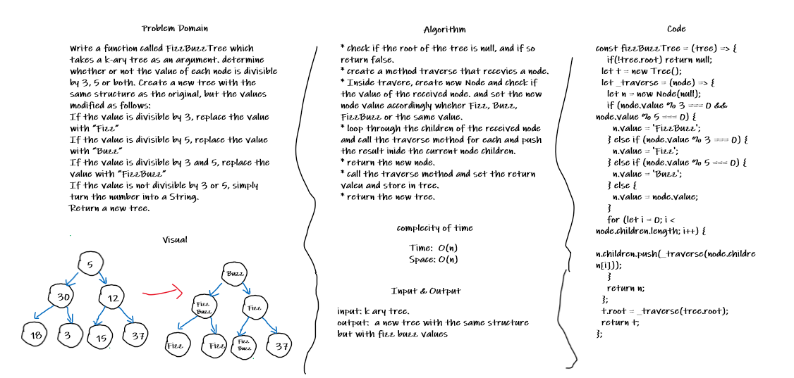

# Fizz Buzz Tree

## Challenge

Write a function called FizzBuzzTree which takes a k-ary tree as an argument. determine whether or not the value of each node is divisible by 3, 5 or both. Create a new tree with the same structure as the original, but the values modified as follows:
If the value is divisible by 3, replace the value with “Fizz”
If the value is divisible by 5, replace the value with “Buzz”
If the value is divisible by 3 and 5, replace the value with “FizzBuzz”
If the value is not divisible by 3 or 5, simply turn the number into a String.
Return a new tree.

## Approach & Efficiency

* check if the root of the tree is null, and if so return false.
* create a method traverse that recevies a node.
* Inside travere, create new Node and check if the value of the received node. and set the new node value accordingly wheher Fizz, Buzz, FizzBuzz or the same value.
* loop through the children of the received node and call the traverse method for each and push the result inide the current node children.
* return the new node.
* call the traverse method and set the return valeu and store in tree.
* return the new tree.

## Whiteboards

