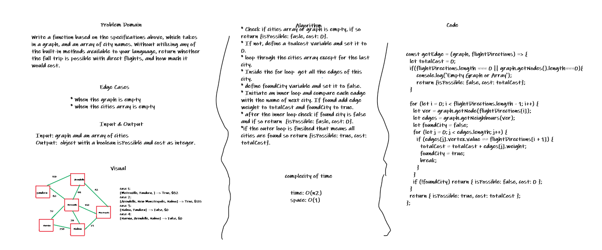

# Get Edge

## Challenge

Write a function based on the specifications above, which takes in a graph, and an array of city names. Without utilizing any of the built-in methods available to your language, return whether the full trip is possible with direct flights, and how much it would cost.

## Approach & Efficiency

* Check if cities array or graph is empty, if so return {isPossible: fasle, cost: 0}.
* If not, define a toalcost variable and set it to 0.
* loop throgh the cities array except for the last city.
* Inside the for loop  get all the edges of this city.
* define foundCity variable and set it to false.
* Initiate an inner loop and compare each eadge with the name of next city. If found add edge weight to totalCost and foundCity to true.
* after the inner loop check if found city is false and if so return  {isPossible: fasle, cost: 0}.
*if the outer loop is finsihed that means all cities are found so return {isPossible: true, cost: totalCost}.

## Whiteboards

