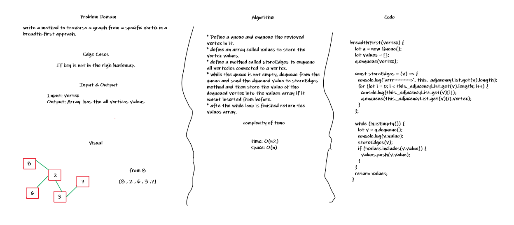

# Graph

## Challenge

Implement graph as an adjacency list, with the following methods: `AddNode`, `AddEdge`, `GetNodes`, `GetNeighbors`, and `Size`.

## API

### `addNode(vertex)`

The `addNode()` method adds a new vertex to the graph.

### `addEdge(startVertex, endVertex, weight)`

The `addEdge(startVertex, endVertex, weight)` method adds the endVertex and weight into the value array of the startVertex.

### `getNodes()`

The `getNodes()` returns an array includes all the values of the nodes in the graph.

### `getNeighbours(vertex)`

The `getNeighbours()` returns an array with the neighbor vertices and the weight of each edge.

### `size()`

The `size()` returns an integer represents the number of the vertices in the graph.

### `breadthFirst()`

The `breadthFirst()` traverse a graph from a specific vertix in a breadth-first apprach and returns an array with the values.

## Whiteboards

