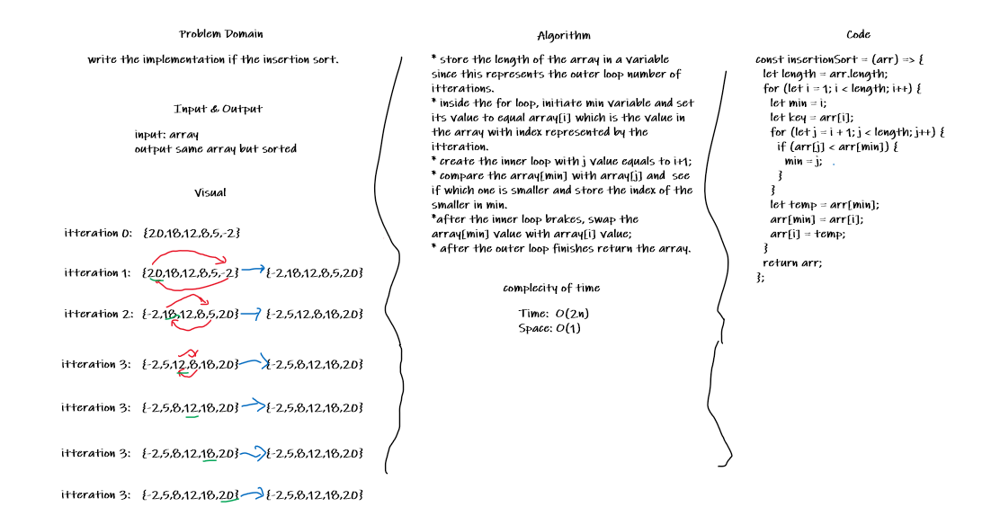

# Insertion Sort

## Challenge

Write the implementation if the insertion sort.

## Approach & Efficiency

* store the length of the array in a variable since this represents the outer loop number of itterations.
* inside the for loop, initiate min variable and set its value to equal array[i] which is the value in the array with index represented by the itteration.
* create the inner loop with j value equals to i+1;
* compare the array[min] with array[j] and  see if which one is smaller and store the index of the smaller in min.
*after the inner loop brakes, swap the array[min] value with array[i] value;
* after the outer loop finishes return the array.

### Complexity:

Time: O(n^2)
Space: O(1)

## Solution

