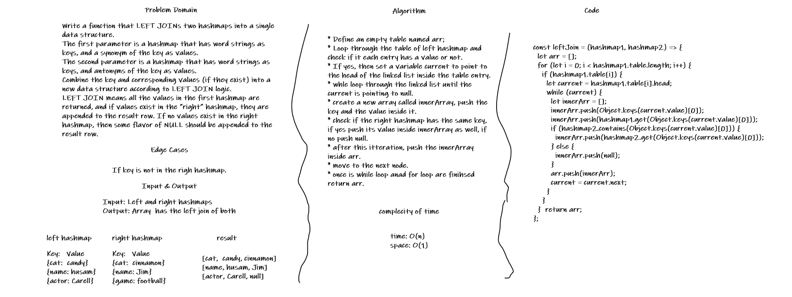

# Left Join

## Challenge

Write a function that LEFT JOINs two hashmaps into a single data structure.
The first parameter is a hashmap that has word strings as keys, and a synonym of the key as values.
The second parameter is a hashmap that has word strings as keys, and antonyms of the key as values.
Combine the key and corresponding values (if they exist) into a new data structure according to LEFT JOIN logic.
LEFT JOIN means all the values in the first hashmap are returned, and if values exist in the “right” hashmap, they are appended to the result row. If no values exist in the right hashmap, then some flavor of NULL should be appended to the result row.

Edge Cases:

* If key is not in the righ hashmap.

## Approach & Efficiency

* Define an empty table named arr;
* Loop through the table of left hashmap and check if it each entry has a value or not.
* If yes, then set a variable current to point to the head of the linked list inside the table entry.
* whle loop through the linked list until the current is pointing to null.
* create a new array called innerArray, push the key and the value inside it.
* check if the right hashmap has the same key, if yes push its value inside innerArray as well, if no push null.
* after this itteration, push the innerArray inside arr.
* move to the next node.
* once is while loop anad for loop are finihsed return arr.

Time: O(n^2)

## Solution

