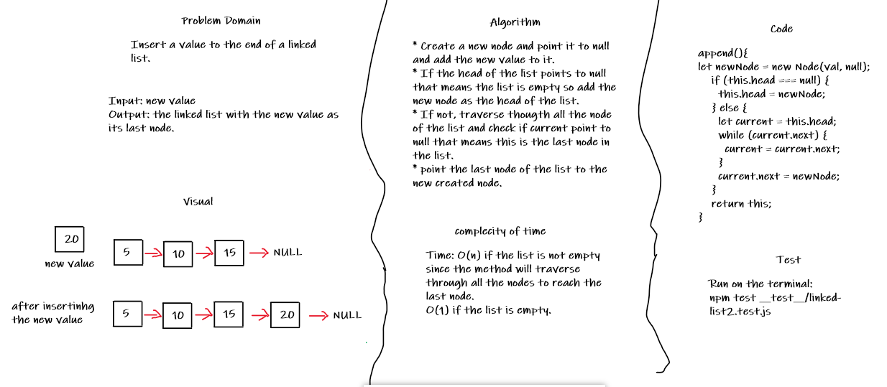
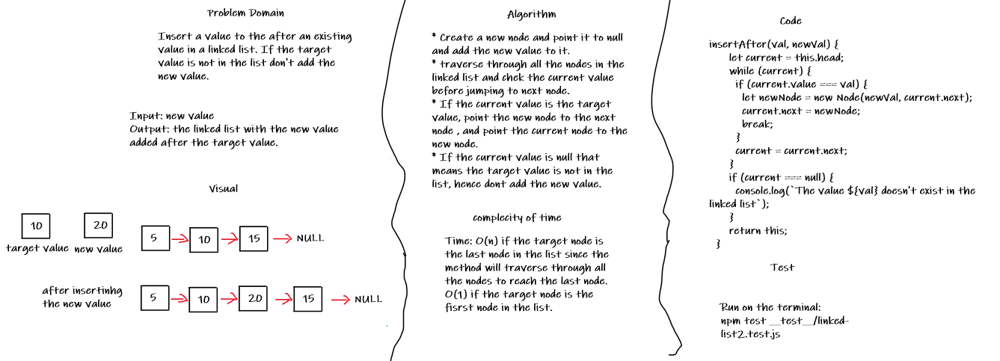
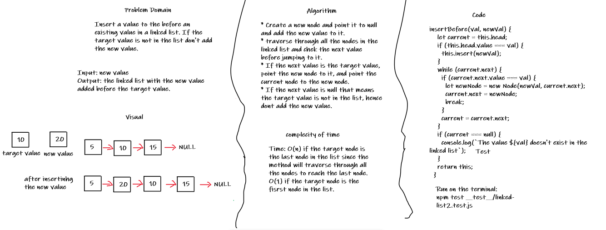

# Linked List

## Challenge

The challenge is to create a linked list which consists of a set of nodes, each node has to properties: a value, and a referece to the next node in the list. The head of the list is basically the fisrt node of it and if the list is empty the head is null.

## Approach & Efficiency

* Any linked list should has a head, and if the linked list is the empty the head should have the null value.
* When inserting to the head of the linked list, the new node should become the head of the list and the will point to the previous head of the list which will become the second node of the list.
* The last node of the list can be called tail and it should point to null.
* Traversing inside the linked list can be done by checking if the current node is pointing to another node or null; if it points to another node the traversing continues, if it points to null, that means this is the last node (tail) in the linked list.

## API

### `insert(value)`

The `insert()` method adds a new node to begining of the list, which makes it the new head of the list. The big O of this method is O(1) since there is no need to use any loops to insert a node to the begining of the list.

### `append(value)`

The `append()` method adds a new node to end of the list, which can be done by treversing through all the nodes till reach the last one and point it to the new node and point the new node to null. The big O of this method is O(1) if the list is empty, if not O(n) since it traverse through all the nodes  to insert a node to the end of the list.

### `insertBefore(value, newValue)`

The `insertBefore()` method adds a new node the list before a value in the list, and if the targeted value is not in the list it doesn't add the new node. The big O of this method is O(1) if the target node is the first one in the list and the worst case and O(n) in the worst case if the target node is the last one in the list.

### `insertAfter(value, newValue)`

The `insert()` method adds a new node the list after a value in the list, and if the targeted value is not in the list it doesn't add the new node. The big O of this method is O(1) if the target node is the first one in the list and the worst case and O(n) in the worst case if the target node is the last one in the list.

### `includes(value)`

The `includes()` checks if a value existis in the list; if it exists the it returns `true`, if not, it returns `false`. The big O of this method is O(1) if the target value is the first one in the list and the worst case and O(n) in the worst case if the target node is the last one in the list.

### `toString()`

The `toString()` method makes a strign shape of the linked list as follows:

`{ value } -> { value} -> ..... -> NULL`.

Example: A linked list has values 3, 4, Hi, 5 and Welcome respectively, the value of using `toString()` method is:

`{ 3 } -> { 4 } -> { Hi } -> { 5 } -> { Welcome } -> NULL`.

The big O of this method is O(n) since it traverse through all the nodes in the list.

## Whiteboards

