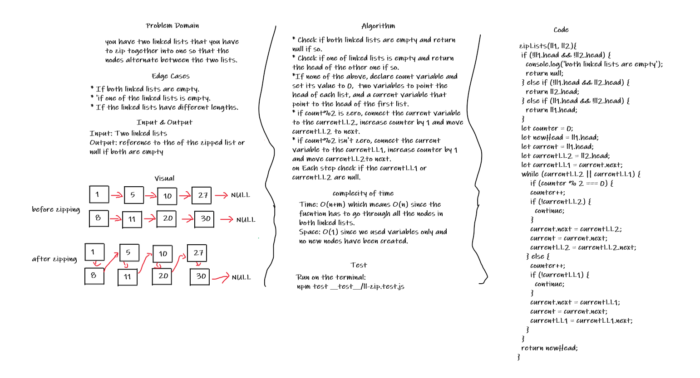

# Shift an Array

## Challenge

you have two linked lists that you have to zip together into one so that the nodes alternate between the two lists.

Edge Cases:

* If both linked lists are empty.
* If one of the linked lists is empty.
* If the linked lists have different lengths.

## Approach & Efficiency

* Check if both linked lists are empty and return null if so.
* Check if one of linked lists is empty and return the head of the other one if so.
*If none of the above, declare count variable and set its value to 0,  two variables to point the head of each list, and a current variable that point to the head of the first list.
* if count%2 is zero, connect the current variable to the currentLL2, increase counter by 1 and move currentLL2 to next.
* if count%2 isn't zero, connect the current variable to the currentLL1, increase counter by 1 and move currentLL2to next.
on Each step check if the currentLL1 or currentLL2 are null.

Time: O(n+m) which means O(n) since the fucntion has to go through all the nodes in both linked lists.

Space: O(1) since we used variables only and no new nodes have been created.

## Solution

