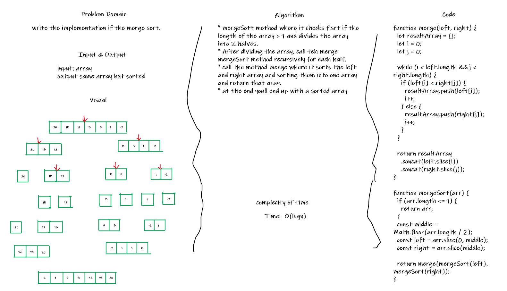

# Merge Sort

## Challenge

write the implementation if the merge sort.

## Approach & Efficiency

* mergeSott method where it checks fisrt if the length of the array > 1 and divides the array into 2 halves.
* After dividing the array, call teh merge mergeSort method recursively for each half.
* call the method merge where it sorts the left and right array and sorting them into one array and return that aray.
* at the end youll end up with a sorted array

### Complexity:

Time: O(log n)

## Solution

