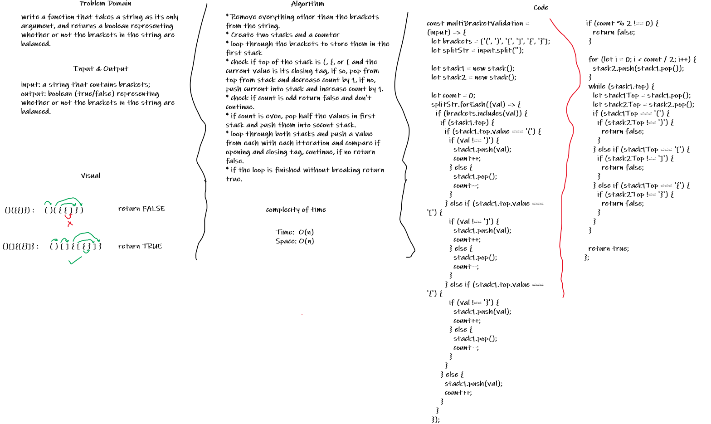

# Multi-bracket Validation

## Challenge

write a function that takes a string as its only argument, and returns a boolean representing whether or not the brackets in the string are balanced.

## Approach & Efficiency

* Remove everything other than the brackets from the string.
* Create two stacks and a counter
* loop through the brackets to store them in the first stack
* check if top of the stack is (, {, or [ and the current value is its closing tag, if so, pop from top from stack and decrease count by 1, if no, push current into stack and increase count by 1.
* check if count is odd return false and don't continue.
* if count is even, pop half the values in first stack and push them into secont stack.
* loop through both stacks and push a value from each with each itteration and compare if opening and closing tag, continue, if no return false.
* if the loop is finished without breaking return true.

Complecity:

* Time:  O(n)
/ Space: O(n)

## Solution

