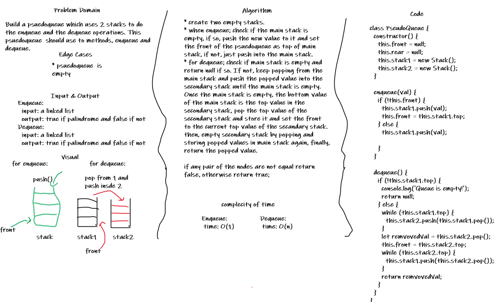

# PseudoQueue

## Challenge

Build a psuedoqueue which uses 2 stacks to do the enqueue and the dequeue operations. This psuedoqueue  should use to methods, enqueue and dequeue.

## Approach & Efficiency

* create two empty stacks, a main stack and a secondary stack.
* when enqueue; check if the main stack is empty, if so, push the new value to it and set the front of the psuedoqueue as top of main stack, if not, just push into the main stack.
* for dequeue; check if main stack is empty and return null if so. If not, keep popping from the main stack and push the popped value into the secondary stack until the main stack is empty. Once the main stack is empty, the bottom value of the main stack is the top value in the secondary stack, pop the top value of the secondary stack and store it and set the front to the current top value of the secandary stack. then, empty secondary stack by popping and storing popped values in main stack again, finally, return the popped value.

if any pair of the nodes are not equal return false, otherwise return true;

## Solution

