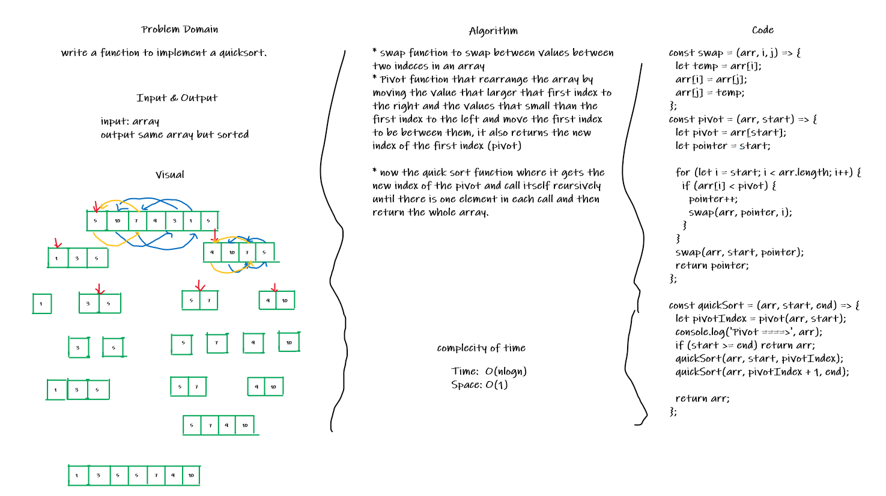

# Quick Sort

## Challenge

write the implementation if the quick sort.

## Approach & Efficiency

* swap function to swap between values between two indeces in an array
* Pivot function that rearrange the array by moving the value that larger that first index to the right and the values that small than the first index to the left and move the first index to be between them, it also returns the new index of the first index (pivot)

* now the quick sort function where it gets the new index of the pivot and call itself reursively until there is one element in each call and then return the whole array.

### Complexity:

Time:  O(nlogn)
Space: O(1)

## Solution

