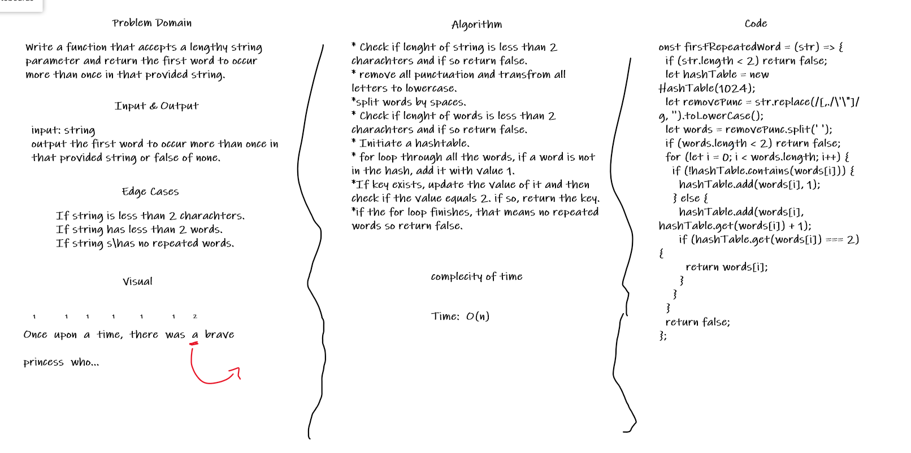

# Repeated Word

## Challenge

Write a function that accepts a lengthy string parameter and return the first word to occur more than once in that provided string.

Edge Cases:

* If string is less than 2 charachters.
* If string has less than 2 words.
* If string s\has no repeated words.

## Approach & Efficiency

* Check if lenght of string is less than 2 charachters and if so return false.
* remove all punctuation and transfrom all letters to lowercase.
*split words by spaces.
* Check if lenght of words is less than 2 charachters and if so return false.
* Initiate a hashtable.
* for loop through all the words, if a word is not in the hash, add it with value 1.
*If key exists, update the value of it and then check if the value equals 2. if so, return the key.
*if the for loop finishes, that means no repeated words so return false.

Time: O(n)

## Solution

